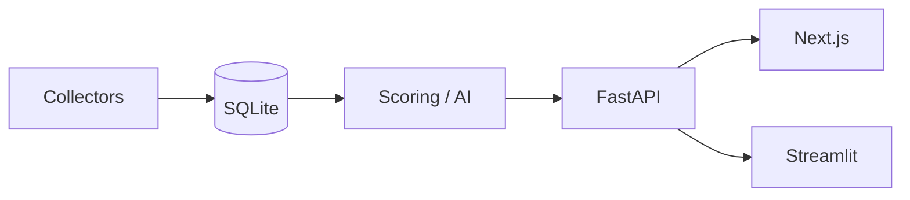

# Iren Sales Intelligence

[](https://opensource.org/licenses/MIT)

Sales intelligence for Iren's commercial team: score and rank prospects from public signals (funding, hiring, AI initiatives) with a competitive intel layer. Python backend, FastAPI, Next.js frontend; SQLite, OpenRouter for generation, Ollama for embeddings. LLM and embeddings are optional—keyword fallbacks throughout so it runs without API keys.

## Architecture



- **Collectors:** RSS, Google News, SEC EDGAR, job boards → normalized signals.
- **Scoring:** 0–100 per prospect from weighted signals; exponential recency decay, configurable half-lives.
- **AI:** OpenRouter for summaries, classification, briefs; Ollama for embeddings (dedup, semantic search). All paths have non-LLM fallbacks.
- **UI:** Next.js (primary) or Streamlit (legacy). API at `:8000`, OpenAPI at `/docs`.

## Quick Start

```bash
# Backend: deps, seed, collect, score
pip install -r requirements.txt
python -c "from database.seed import seed_database; seed_database()"
python -m collectors.runner
python -c "from scoring.engine import score_all_prospects; score_all_prospects()"

# API
cd api && pip install -r requirements.txt && uvicorn main:app --reload --port 8000

# Frontend (separate terminal)
cd frontend && npm install && npm run dev
```

Frontend: [http://localhost:3000](http://localhost:3000). API docs: [http://localhost:8000/docs](http://localhost:8000/docs).

Optional: `export OPENROUTER_API_KEY` for LLM features; run Ollama + `python -m ai.embed_backfill` for embedding-based dedup and search.

## Scoring Model

<!-- AUTO: scoring-table -->
| Signal | Max Points | What It Detects |
|--------|-----------|-----------------|
| Active Fundraising | 20 | Currently raising — timing signal for outreach |
| Completed Funding | 15 | Recently closed a round — capacity signal |
| Infrastructure Hiring | 25 | GPU/ML/infra job postings — strongest demand signal |
| AI Initiatives | 15 | Model training, AI product launches |
| Cloud Spend | 15 | High cloud bills, cost optimization signals |
| Outgrowing Provider | 10 | Capacity complaints, provider switching |
<!-- /AUTO -->

Weights and half-lives in `scoring/weights.py`; category caps sum to 100.

## Project Layout

```
config.py               Env, constants, signal/source enums
database/               Models, session, seed
collectors/             RSS, funding, jobs, SEC; BaseCollector + runner
scoring/                Weights, recency decay, score_prospect()
ai/                     Embeddings (Ollama), summarizer, classifier, briefs (OpenRouter + fallbacks)
api/main.py             FastAPI JSON API
frontend/               Next.js (prospects, compete, admin)
pages/                  Streamlit (legacy)
tests/                  pytest, in-memory SQLite
```

## Tests

```bash
python -m pytest tests/ -v
```

No API keys or Ollama required; embeddings mocked.

## Deploy / Publish

`.env`, `data/`, `.venv/` are gitignored. Copy `.env.example` to `.env` for secrets. After clone: seed, run collectors, score, then start API and frontend.
