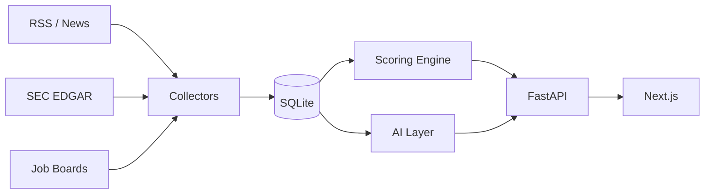

# Iren Sales Intelligence

[](https://opensource.org/licenses/MIT)

Signals-to-pipeline tool for Iren's commercial team. Ingests public signals (funding rounds, infra hiring, SEC filings, AI launches), runs a multi-factor scoring model across each prospect, and surfaces ranked accounts with AI-generated briefs and battle cards.

Designed to run with or without an LLM: every generation and classification path has a keyword-based fallback, so the scoring and UI work without API keys.

## How it works

**Signal ingestion** — four collectors pull from RSS feeds, Google News, SEC EDGAR, and job boards. Each signal is normalized into a type (fundraising, hiring, AI initiative, etc.), source, magnitude, and timestamp. Semantic dedup via Ollama embeddings prevents double-counting the same story across sources.

**Scoring** — each prospect gets a 0–100 score per run. Formula per signal:

```
points = base_points × recency_decay × magnitude_multiplier × source_confidence
```

- `recency_decay`: exponential half-life per signal type (e.g. "fundraising" decays faster than "hiring")
- `magnitude_multiplier`: tiered thresholds — a $1B raise scores higher than a $10M one
- `source_confidence`: SEC filing (1.0) vs. social media rumor (0.2)
- Category score capped; all category caps sum to 100

**Generation** — OpenRouter (or any OpenAI-compatible endpoint) for summaries, signal classification, sales briefs, outreach emails, and battle cards. Falls back to keyword extraction and templates if no API key is set.

## Architecture



## Quick Start

```bash
# 1. Backend: deps, seed, collect, score
pip install -r requirements.txt
python -c "from database.seed import seed_database; seed_database()"
python -m collectors.runner
python -c "from scoring.engine import score_all_prospects; score_all_prospects()"

# 2. API (separate terminal)
cd api && pip install -r requirements.txt && uvicorn main:app --reload --port 8000

# 3. Frontend (separate terminal)
cd frontend && npm install && npm run dev
```

- Frontend: [http://localhost:3000](http://localhost:3000)
- API + OpenAPI docs: [http://localhost:8000/docs](http://localhost:8000/docs)

**Optional:** `export OPENROUTER_API_KEY=sk-or-...` for AI features. Run `ollama pull nomic-embed-text` + `python -m ai.embed_backfill` for semantic dedup and search.

## Scoring Model

<!-- AUTO: scoring-table -->
| Signal | Max Points | What It Detects |
|--------|-----------|-----------------|
| Active Fundraising | 20 | Currently raising — timing signal for outreach |
| Completed Funding | 15 | Recently closed a round — capacity signal |
| Infrastructure Hiring | 25 | GPU/ML/infra job postings — strongest demand signal |
| AI Initiatives | 15 | Model training, AI product launches |
| Cloud Spend | 15 | High cloud bills, cost optimization signals |
| Outgrowing Provider | 10 | Capacity complaints, provider switching |
<!-- /AUTO -->

Weights, half-lives, and magnitude tiers are in `scoring/weights.py`. Scoring reruns are cheap — rescore after tweaking weights without re-ingesting.

## Project Layout

```
config.py               Env, constants, signal/source enums
database/               SQLAlchemy models, session, seed data
collectors/             BaseCollector, RSS, funding, jobs, SEC EDGAR, runner
scoring/                Weights config, recency decay, score_prospect(), delta tracking
ai/                     Ollama embeddings, OpenRouter summarizer/classifier/brief generator
api/main.py             FastAPI — thin JSON wrapper over the Python backend
frontend/               Next.js — prospects, competitor intel, admin
pages/                  Streamlit (legacy)
tests/                  121 tests, in-memory SQLite, mocked embeddings
```

## Tests

```bash
python -m pytest tests/ -v   # 121 tests, no API keys or Ollama needed
```

## Config

Copy `.env.example` to `.env`. Only `OPENROUTER_API_KEY` is needed for AI features; everything else has a default.
